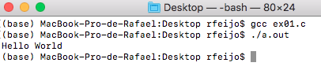

## Dia 1

### 1 - *Hello World*

Para iniciarmos, façamos um exemplo clássico que apresente a mensagem "*Hello World*" na saída. Escreva o código em C, utilizando algum compilador de sua preferência.

O resultado deverá ser algo como:

<p align="center">
  
</p>

### 2 - Funções

Vamos começar a modularizar o código. Para isso, crie um função que receba uma *string* e a imprima na saída conforme o exemplo abaixo.

```
Hello World.
```

Sendo "*World*" uma string declarada na ```main()``` e passada para a função ```ft_printMessage()```.

O resultado deverá ser algo como:

<p align="center">
  
</p>

### 3 - Funções & Múltiplas Chamadas

Com o mesmo código anterior, passe 2 parâmetros distintos para a função ```ft_printMessage()```, ambos declarados na ```main()```, sendo eles:

1. "World";
2. Seu nome;

O resultado deverá ser algo como:

<p align="center">
  
</p>

### 4 - Modularização

Para códigos complexos, a melhor abordagem é estruturá-lo por tipos de periféricos (RTC, WiFi, GSM, etc).

As principais vantagens são:

* Redução no custo de manutenção;
* Aumento no aproveitamento do código;

#### 4.1 - Arquivos *.c*

Nesta etapa, serão necessários 2 arquivos, o arquivo principal (```ex04.c```) e a biblioteca visada (```library.cpp```).

Após a criação dos arquivos, crie as funções dentro do arquivo ```library.cpp``` e inclua-o no arquivo principal, conforme demonstrado abaixo.

<p align="center">
  
</p>


## Programação Orientada a Objetos 

<p align="center">
  
</p>

* Redução no custo de manutenção;
* Aumento no aproveitamento do código;

## Caracterização de Classes, Atributos, Métodos e Objetos
Considere o seguinte trecho de código:
```
class fila {
  public:
    void reset(void); 
    void put(int valor); 
    int  get(int posicao);
 
  private:
    int f[100] = {0};
    int primeiro, ultimo;
};
```

### Classes
Uma classe é um gabarito para a definição de objetos. Através da definição de uma classe, descreve-se que propriedades, ou atributos, o objeto terá.

Além da especificação de atributos, a definição de uma classe descreve também qual o comportamento de objetos da classe, ou seja, que funcionalidades podem ser aplicadas a eles. Essas funcionalidades são descritas através de métodos, que são equivalentes a uma função, com a restrição que ele manipula apenas suas variáveis locais e os atributos que foram definidos para a classe.

No caso do código acima, a classe "fila" foi definida. Nela, há partes públicas, em que o usuário tem acesso, e partes privadas, em que o usuário não tem acesso.

### Atributos
Atributos são, basicamente, a estrutura de dados que vai representar a classe.

Para o exemplo dado, são atributos:
* ```int f[100];```
* ```int primeiro, ultimo;```

### Métodos
Métodos são declarados dentro de uma classe para representar as operações que os objetos pertencentes a esta classe podem executar, ou seja, são as funções da classe.

Para o exemplo dado, são métodos:
```
void reset (void)
{
  primeiro = 0;
  ultimo = 0;
}
```
```
void put(int valor)
{
  f[ultimo] = valor;
  ultimo = (ultimo + 1) % 100;
}
```
```
int get(int posicao)
{
  return f[posicao];
}
```

### Objetos
De maneira simples, os objetos são entidades lógicas que farão uso dos atributos e métodos de sua classe. Ou seja, considere a seguinte hipótese:

> Uma escola possui 3 refeitórios, cada um independente do outro.

Neste caso, é de se esperar que existam 3 filas simultâneas, uma para cada refeitório.

Ou seja, considerando a classe "fila", poderíamos criar 3 objetos:

```
fila f1, f2, f3;
```
Tal que "f1", "f2", e "f3" são objetos da classe "fila" e, portanto, cada um desses objetos possui seus atributos e métodos, independentes entre si.
