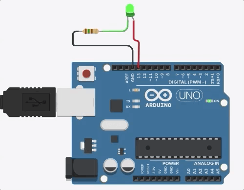

## Aula 2

### 1 - *Arduino Blynk*

Escreva um programa, na *IDE* do *Arduino*, que pisque o *LED* 13 (interno) em 1*Hz*.

<p align="center">
  
</p>

### 2 - *Arduino Blynk* Sequencial para 3 *LEDs*

Apesar de simples associar *LEDs* aos *GPIOs* do *Arduino*, podemos facilitar a montagem utilizando o *Serial Console*.


#### 5.1 - Caracterização de Classes, Atributos, Métodos e Objetos

Considere o seguinte trecho de código:
```
class fila {
  public:
    void reset(void); 
    void put(int valor); 
    int  get(int posicao);
 
  private:
    int f[100] = {0};
    int primeiro, ultimo;
};
```

##### 5.1.1 - Classes

Uma classe é um gabarito para a definição de objetos. Através da definição de uma classe, descreve-se que propriedades, ou atributos, o objeto terá.

Além da especificação de atributos, a definição de uma classe descreve também qual o comportamento de objetos da classe, ou seja, que funcionalidades podem ser aplicadas a eles. Essas funcionalidades são descritas através de métodos, que são equivalentes a uma função, com a restrição que ele manipula apenas suas variáveis locais e os atributos que foram definidos para a classe.

No caso do código acima, a classe "fila" foi definida. Nela, há partes públicas, em que o usuário tem acesso, e partes privadas, em que o usuário não tem acesso.

##### 5.1.2 - Atributos

Atributos são, basicamente, a estrutura de dados que vai representar a classe.

Para o exemplo dado, são atributos:
* ```int f[100];```
* ```int primeiro, ultimo;```

##### 5.1.3 - Métodos

Métodos são declarados dentro de uma classe para representar as operações que os objetos pertencentes a esta classe podem executar, ou seja, são as funções da classe.

Para o exemplo dado, são métodos:
```
void reset (void)
{
  primeiro = 0;
  ultimo = 0;
}
```
```
void put(int valor)
{
  f[ultimo] = valor;
  ultimo = (ultimo + 1) % 100;
}
```
```
int get(int posicao)
{
  return f[posicao];
}
```

##### 5.1.4 - Objetos

De maneira simples, os objetos são entidades lógicas que farão uso dos atributos e métodos de sua classe. Ou seja, considere a seguinte hipótese:

> Uma escola possui 3 refeitórios, cada um independente do outro.

Neste caso, é de se esperar que existam 3 filas simultâneas, uma para cada refeitório.

Ou seja, considerando a classe "fila", poderíamos criar 3 objetos:

```
fila f1, f2, f3;
```
Tal que "f1", "f2", e "f3" são objetos da classe "fila" e, portanto, cada um desses objetos possui seus atributos e métodos, independentes entre si.
