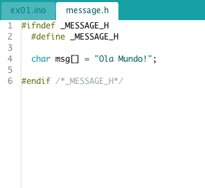

## Programação Orientada a Objetos

### #include guards [ex01.ino]
Os "#include guards" são estruturas de segurança utilizadas para evitar definições de mesmas variáveis. 

Por exemplo, suponha que você tenha os seguintes arquivos:
<p align="center">
  
  
</p>

Observer que o arquivo "message.h" apenas declara a variável "msg[]". O resto de seu conteúdo pode ser traduzido, para um melhor entendimento, como:
```
if (!_MESSAGE_H)
{
  _MESSAGE_H = true;
  
  char msg[] = "Ola Mundo!";
}
```

### Blink [ex02.ino]
Nesse exemplo, foram criados 3 arquivos:
1. blink.h, cabeçalho contendo a declaração da classe
<p align="center">
  
</p>
2. blink.cpp, arquivo contendo as funções da classe
<p align="center">
  
</p>
3. ex02.ino, arquivo principal
<p align="center">
  
</p>
Na main é criado o objeto "led", que possui os métodos e atributos da classe "Blink". O código se resume ao "setup()", em que inicialize-se o Serial Console, então é chamada a função "ft_begin()" para configuração e, por fim, é chamada a função "ft_blink".

### Desafio
Utilizando o código "ex02.ino", adicione o atributo ```bool enable;```, inicializado em "false", a classe "Blink". Em seguida, faça com que essa variável receba o valor escrito no LED - HIGH e LOW. Por fim, crie uma condição no "loop()" que imprima as seguintes mensagens no Serial Console, respeitando a condição do LED:
1. "LED aceso.";
2. "LED apagado.";
