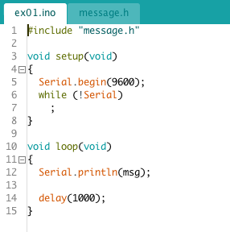

## Aula 3

### 1 - Biblioteca *Blynk*

Para recapitular, vamos recriar nossa biblioteca da aula anterior do zero, utilizando os conceitos de *POO*.

> 1. *Blynk.h*
>
> * Crie a classe ```Blynk```, com campo *public* e *private*;
> * Inclua os protótipos públicos ```void begin(int pin);``` e ```void loop(void);```;
> * Crie as variáveis privadas necessárias para a biblioteca;

> 2. *Blynk.cpp*
>
> * Na função ```void begin(int pin);```, armazene a *GPIO* associada ao *LED*, configure este pino como *OUTPUT*, inicialize-o como *LOW*;
> * Na função ```void loop(void);```, inverta o estado do *GPIO*. Lembre-se de utilizar o *Serial Console* caso não tenha *LEDs* a mão;

> 3. *ex03.ino*
>
> * Utilize o arquivo ```/Codigos/Aula03/ex01/ex01.ino```, sem alterá-lo;

### 2 - *Include Guards*

Os *Include Guards* são estruturas de segurança utilizadas para evitar definições de mesmas variáveis.

Por exemplo, suponha que você tenha os seguintes arquivos:

<p align="center">
  
  
</p>

Observer que o arquivo "message.h" apenas declara a variável "msg[]". O resto de seu conteúdo pode ser traduzido, para um melhor entendimento, como:

```
if (!_MESSAGE_H)
{
  _MESSAGE_H = true;
  
  char msg[] = "Ola Mundo!";
}
```

> Lembre-se de atualizar o código criado na ```seção 1```, adicionado os *Include Guards*.

### 3 - *delay()* VS *millis()*

Sabemos que a função ```delay()``` causa uma pausa na execução de um programa, congelando o *status* da rotina durante este tempo. Por isso, ao usar o *delay*, não conseguimos executar nenhuma ação enquanto esta pausa é executada.

Entretanto, imagine que seu programa deva piscar um *LED* vermelho a cada *1s* e piscar um *LED* verde a cada *300ms*. Apesar de ser possível calcular uma série de *delays*, o problema fica complexo quando seu programa executa mais tarefas.

Para resolver este problema, podemos substituir o *delay* por um bloco de código que não trava a execução do programa. Para isso, usaremos a função ```millis()```, que retorna o tempo, em milissegundos, desde quando o arduino foi ligado ou reiniciado. Desta forma, conseguimos verificar a quanto tempo nosso programa está em execução.

Sabendo o tempo total podemos, por exemplo, executar uma ação a cada 1 segundo sem travar o loop, basta para isso verificar se se passou 1 segundo desde a última execução. Um modelo básico seria:

<p align="center">
  
</p>

### 4 - Otimização de Memória

#### 4.1 - Registradores

Apesar de pouco usado, é possível realizar operações diretamente com os registrados do *Arduino*.

No geral, placas ATmega8, ATmega168 e ATmega328 possuem 3 registradores:

1. B (pinos digitais 8 ~ 13)
2. C (pinos analógicos)
3. D (pinos digitais 0 ~ 7)

```
#define LED 13

long timer = 0;

void setup(void)
{
  // Configura os GPIOs
  DDRB  = DDRB | B00100000;      // pinMode(LED, OUTPUT);
  PORTB = 0x00;                  // digitalWrite(LED, LOW);
}

void loop(void)
{
  if (millis() > timer + 500)
  {
    PINB = bit(5);               //digitalWrite(LED, !digitalRead(LED));
    
    timer = millis();
  }
}
```

O programa acima utiliza *546 bytes* de memória *flash* e *13 bytes* de memória dinâmica.

> Fonte: https://www.arduino.cc/en/Reference/PortManipulation

#### 4.2 - ```int main()```

Como qualquer código escrito, seu programa também possui uma função ```main()```, e, apesar de não aparente, as funções ```setup()``` e ```loop()``` estão dentro dela.

```
#define LED 13

long timer = 0;

int main(void)
{
  // Configura os GPIOs
  DDRB  = DDRB | B00100000;      // pinMode(LED, OUTPUT);
  PORTB = 0x00;                  // digitalWrite(LED, LOW);  

  while (true)
  {
    if (millis() > timer + 500)
    {
      PINB = bit(5);             //digitalWrite(LED, !digitalRead(LED));
      
      timer = millis();
    }
  }
}
```

O programa acima utiliza *400 bytes* de memória *flash* e *13 bytes* de memória dinâmica.

#### 4.3 - *Delay* com ```for()```

Por fim, a biblioteca ```Arduino.h``` possui algumas variáveis globais para gerenciamento do *RTC*. 

O código abaixo força um *delay* com um *for loop*:

```
#define LED 13

long timer = 0;

int main(void)
{
  // Configura os GPIOs
  DDRB  = DDRB | B00100000;           // pinMode(LED, OUTPUT);
  PORTB = 0x00;                       // digitalWrite(LED, LOW);  

  while (true)
  {
    PINB = bit(5);                    // digitalWrite(LED, !digitalRead(LED));

    for (long i=0; i<500000; i++)     // delay();
      asm("");
  }
}
```

O programa acima utiliza *158 bytes* de memória *flash* e *0 bytes* de memória dinâmica.
