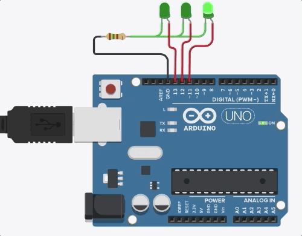

## Aula 2

### 1 - *Arduino Blynk*

Escreva um programa, na *IDE* do *Arduino*, que pisque o *LED* 13 (interno) em 1*Hz*.

<p align="center">
  
</p>

### 2 - *Arduino Blynk* Sequencial para 3 *LEDs*

Apesar de simples associar *LEDs* aos *GPIOs* do *Arduino*, podemos facilitar a montagem utilizando o *Serial Console*.

<p align="center">
  
</p>

### 3 - Biblioteca Blynk

Vamos criar nossa 1ª biblioteca, utilizando os conceitos de *POO*.

1. *Blynk.h*

```
#include <Arduino.h>

class Blynk
{
  public:
    void begin(int pin);
    void loop(void);

  private:
    int  pin_;
    bool state;
};
```

2. *Blynk.cpp*

```
#include "Blynk.h"

void Blynk::begin(int pin)
{
  pin_ = pin;
  
  pinMode(pin, OUTPUT);

  state = false;

  digitalWrite(pin, state);
}

void Blynk::loop(void)
{
  state = !state;
  
  digitalWrite(pin_, state);

  Serial.println(String(pin_)+": "+String(state));
}

```

3. *ex03.ino*

```
// Includes
  #include "Blynk.h"

// Pre-Processing
  Blynk LED1;

void setup(void)
{
  // Inicializa o Serial Console
  Serial.begin(9600);
  while (!Serial)
    ;
  
  // Configura os GPIOs
  LED1.begin(13);
}

void loop(void)
{
  LED1.loop();
  delay(1000);
}
```

### 4 - Biblioteca Blynk com Múltiplos Objetos

Por fim, para expandir o código anterior para 3 *LEDs*, basta adicionar objetos no arquivo ```ex04.ino```, como a seguir:

```
// Includes
  #include "Blynk.h"

// Pre-Processing
  Blynk LED1, LED2, LED3;

void setup(void)
{
  // Inicializa o Serial Console
  Serial.begin(9600);
  while (!Serial)
    ;
  
  // Configura os GPIOs
  LED1.begin(13);
  LED2.begin(12);
  LED3.begin(11);
}

void loop(void)
{
  LED1.loop();
  LED2.loop();
  LED3.loop();
  delay(1000);
}
```
